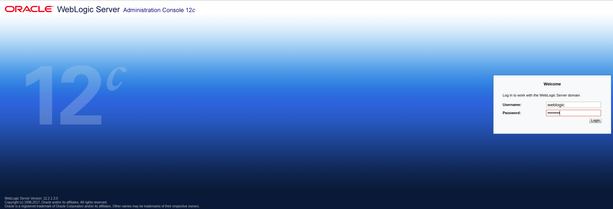
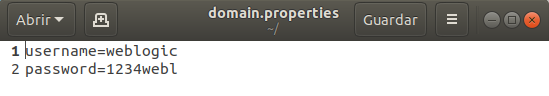
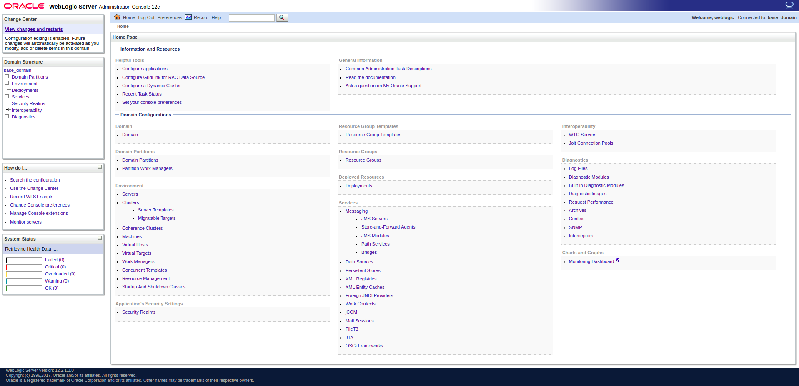
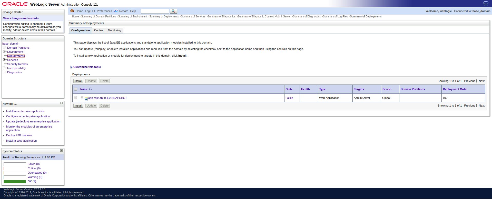
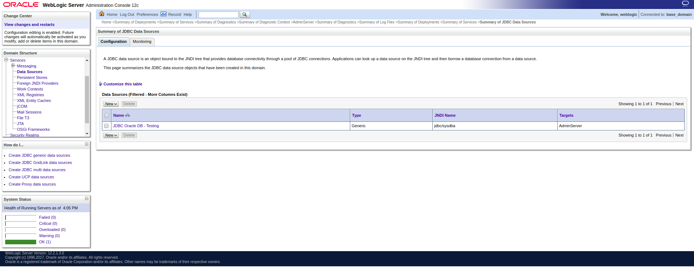
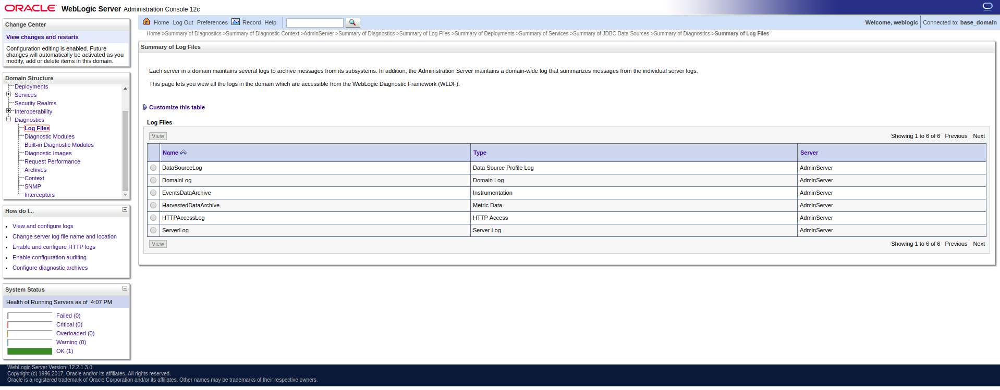

# Accediendo a weblogic

Primero, tras arrancar el contenedor, deberemos acceder a <https://localhost:9002/console/login/LoginForm.jsp>:

E introducir el usuario y la contraseña que pusimos en el *"domain.properties"*. Por ejemplo:

Tras acceder veremos todas las opciones de la consola:

A la izquiera podremos ver las diferentes secciones que tiene toda la consola. Éstas cuelgan directamente de *base_domain* que es el dominio principal de nuestro servidor de aplicaciones.

---base_domain

&nbsp;&nbsp;|--Domain Partitions undefinedDomain Partitions

&nbsp;&nbsp;|--Environment undefinedEnvironment

&nbsp;&nbsp;|--Deployments

&nbsp;&nbsp;|--Services Expand Node Services

&nbsp;&nbsp;|--Security Realms

&nbsp;&nbsp;|--Interoperability Expand Node Interoperability

&nbsp;&nbsp;|--Diagnostics Expand Node Diagnostics

De todas estas secciones destacaremos *Deployments* que será el lugar donde podamos **desplegar** nuestras aplicaciones, *Services* que entre otras opciones es donde deberemos ir a configurar la **conexión a BBDD** y *Diagnostics* que será donde, entre otras opciones, podamos ver los **logs de WL**.

Ejemplo de la sección de **Deployments**:

Ejemplo de la sección de **Services**:

Conjunto de logs que se pueden ver desde la sección de **Diagnostics**:

Entre otras opciones estás serán las más utilizadas durante el curso. Para mayor información revisar el siguiente enlace a Oracle WL <https://www.oracle.com/middleware/technologies/weblogic.html>.