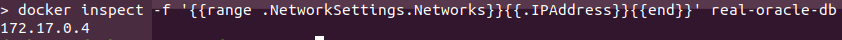
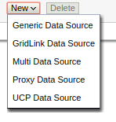
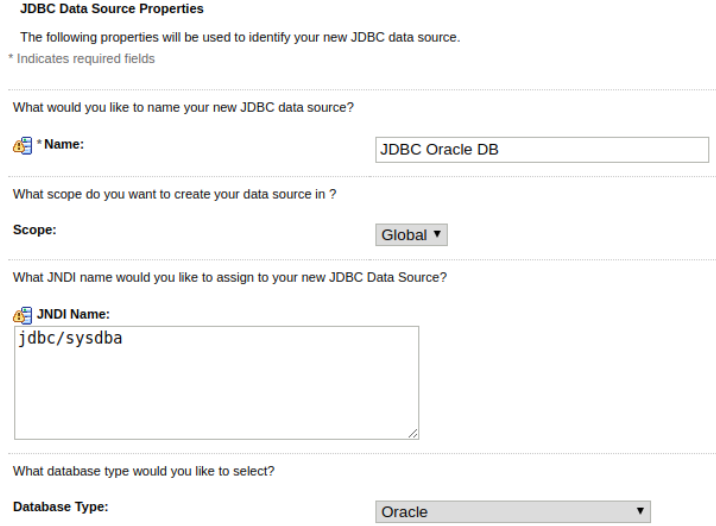
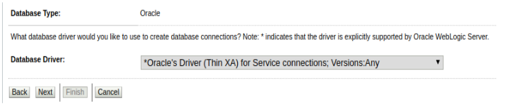
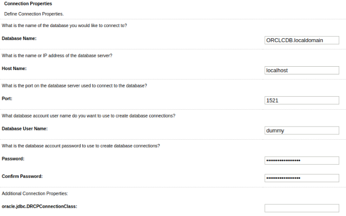
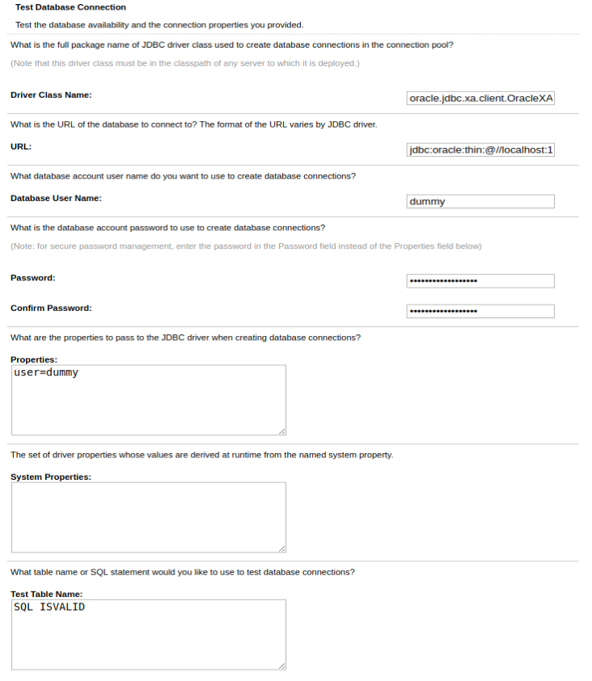
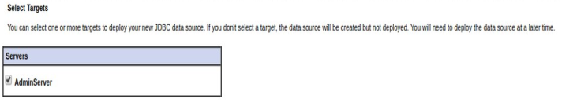

# Configuracion de la conexión a la Oracle DB

### CONEXIÓN A LA DB

Para poder configurar la conexión a la BBDD primero se deberá obtener la IP del contenedor de la Oracle DB empleando el comando `docker inspect -f '{{range .NetworkSettings.Networks}}{{.IPAddress}}{{end}}' real-oracle-db`.

Esta será la **IP que haya que configurar en WL** para conectar a la BBDD.

&nbsp;

### CONEXIÓN DESDE WL

Para poder configurar la conexión a la BBDD deberemos ir `base_domain >> Services >> Data Sources` y pulsar sobre el botón de `New`:

Y selecionaremos la opción de `Generic Data Source` y en la siguiente vista pondremos la siguiente información del JDBC Data Source:

Como se ve en la imagen, rellenaremos estos dos campos:

&nbsp;&nbsp;&nbsp;- Name: JDBC Oracle DB

&nbsp;&nbsp;&nbsp;- JNDI Name: jdbc/sysdba

Y pulsaremos sobre el botón de `Next`. En la siguiente vista pondremos la información que se muestra a continuación:

Seleccionaremos del desplegable:

&nbsp;&nbsp;&nbsp;- Database Driver: *Oracle's Driver (Thin XA) for Application Continuity; Versions:Any

Pulsaremos sobre el botón de `Next`. En la siguiente vista pondremos la información, teniendo en cuenta que ***no nos vamos a conectar al localhost*** (que sería la máquina del contenedor) sino la ***dirección IP que hemos extraido al comienzo*** de esta sección:

La información a rellenar será:

&nbsp;&nbsp;&nbsp;- Database Name: ORCLCDB.localdomain

&nbsp;&nbsp;&nbsp;- Host Name: la dirección IP del contenedor *no localhost*

&nbsp;&nbsp;&nbsp;- Port: 1521

&nbsp;&nbsp;&nbsp;- Database User Name: dummy

&nbsp;&nbsp;&nbsp;- Password: dummy

&nbsp;&nbsp;&nbsp;- Confirm Password: dummy

Pulsaremos sobre el botón de `Next`. En la siguiente vista deberemos validar los datos que hemos ido rellenando:

La información deberá ser la siguiente:

&nbsp;&nbsp;&nbsp;- Driver Class Name: oracle.jdbc.xa.client.OracleXADataSource

&nbsp;&nbsp;&nbsp;- URL: jdbc:oracle:thin:@//172.17.0.3:1521/ORCLCDB.localdomain

&nbsp;&nbsp;&nbsp;- Database User Name: dummy

&nbsp;&nbsp;&nbsp;- Password: dummy

&nbsp;&nbsp;&nbsp;- Confirm Password: dummy

A continuación podremos validar la conexión a la BBDD haciendo click sobre el botón `Test connection` si ha sido todo valido pulsaremos sobre `Next` sino habrá que repetir los pasos anteriores.

Y finalizaremos el proceso de configuración haciendo en clic sobre el botón `Finish`.
