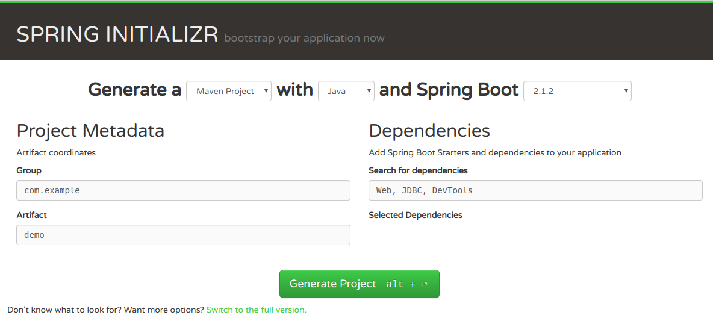
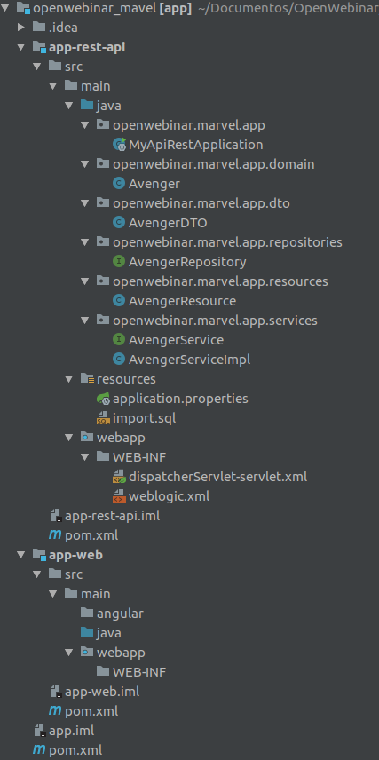

# Desarrollo del API que consumira la Oracle DB

### Introducción
Vamos a desarrollar un **API en Java** muy simple que nos permita interactuar con la Oracle DB a través del Weblogic que hemos estado trabajando.
Será la propia app la que se encargue de **añadir datos** a la tabla que se define en el propio modelo de datos que veremos a continuación.
Hay aplicaciones que se encargan de generar todo el código como por ejemplo <https://start.spring.io/>, pero en nuestro caso vamos a crearla nosotros desde cero. Si quisieras emplear la web, comentar que necesitarás las siguientes opciones:

&nbsp;&nbsp;&nbsp;- Dependencies:

&nbsp;&nbsp;&nbsp;&nbsp;&nbsp;&nbsp;- Web

&nbsp;&nbsp;&nbsp;&nbsp;&nbsp;&nbsp;- JDBC

&nbsp;&nbsp;&nbsp;&nbsp;&nbsp;&nbsp;- DevTools



Nuestra app estará dividida en varias partes:

&nbsp;&nbsp;&nbsp;- **Ejecutable de la aplicación**: será la clase principal, la entrada a la app.

&nbsp;&nbsp;&nbsp;- **Modelo de datos**: Será el modelo de datos que tiene la tabla. Deberemos tener dos, el de la BBDD y el que emplearemos en la aplicación Java (así aislamos la capa de BBDD y la de aplicación).

&nbsp;&nbsp;&nbsp;- **Repositorio**: Es la interfaz con los métodos que van a atacar a la BBDD.

&nbsp;&nbsp;&nbsp;- **Servicio**: Es la capa encargada de la comunicación entre el repositorio y el recurso.

&nbsp;&nbsp;&nbsp;- **Recurso**: Serán los endpoints contra los cuales podamos acceder desde una aplicación externa como *CURL* o *Postman* entre otras.

A su vez la estuctura del proyecto estará formada por una **carpeta padre** que es la que contiene todo el proyecto en si y dos **carpetas hijo**:

&nbsp;&nbsp;&nbsp;- **app-web**: Será la que contenga la parte web. En nuestro caso lo vamos a dejar vacío.

&nbsp;&nbsp;&nbsp;- **app-rest-api**: Será la que tenga la lógica Java.

Añadir que es un proyecto basado en **Maven** por lo que constará de tres *pom.xml*, uno para el padre y otro para cada hijo.

&nbsp;

### Estructura Maven

El proyecto consta de tres *pom.xml*

#### __Padre pom.xml__

Será el que tenga las dependencias y la estructura del proyecto:

```
<?xml version="1.0" encoding="UTF-8"?>
<project xmlns="http://maven.apache.org/POM/4.0.0" xmlns:xsi="http://www.w3.org/2001/XMLSchema-instance"
	xsi:schemaLocation="http://maven.apache.org/POM/4.0.0 http://maven.apache.org/xsd/maven-4.0.0.xsd">
	<modelVersion>4.0.0</modelVersion>

	<groupId>openwebinar.marvel.app</groupId>
	<artifactId>app</artifactId>
	<version>0.1.0-SNAPSHOT</version>
	<packaging>pom</packaging>
	<name>rest-api</name>
	<description>Demo for Openwebinar</description>

	<parent>
        <groupId>org.springframework.boot</groupId>
        <artifactId>spring-boot-starter-parent</artifactId>
        <version>2.0.0.M7</version>
    </parent>

	<properties>
		<project.build.sourceEncoding>UTF-8</project.build.sourceEncoding>
		<project.reporting.outputEncoding>UTF-8</project.reporting.outputEncoding>
		<java.version>1.8</java.version>
	</properties>

	<repositories>
		<repository>
			<id>spring-milestones</id>
			<name>Spring Milestones</name>
			<url>https://repo.spring.io/milestone</url>
			<snapshots>
				<enabled>false</enabled>
			</snapshots>
		</repository>
		<repository>
			<id>repository.springframework.maven.release</id>
			<name>Spring Framework Maven Release Repository</name>
			<url>http://maven.springframework.org/milestone/</url>
		</repository>
		<repository>
			<id>org.springframework</id>
			<url> http://maven.springframework.org/snapshot</url>
		</repository>
		<repository>
			<id>spring-milestone</id>
			<name>Spring Maven MILESTONE Repository</name>
			<url>http://repo.spring.io/libs-milestone</url>
		</repository>
		<repository>
			<id>spring-release</id>
			<name>Spring Maven RELEASE Repository</name>
			<url>http://repo.spring.io/libs-release</url>
		</repository>
	</repositories>
	<pluginRepositories>
		<pluginRepository>
			<id>spring-milestones</id>
			<name>Spring Milestones</name>
			<url>https://repo.spring.io/milestone</url>
			<snapshots>
				<enabled>false</enabled>
			</snapshots>
		</pluginRepository>
	</pluginRepositories>
	
    <modules>
        <module>app-rest-api</module>
        <module>app-web</module>
    </modules>

</project>
```


#### __Hijo frontend pom.xml__

En este caso lo dejaremos por defecto, ya que no vamos a añadir nada a nivel de frontal.

```
<?xml version="1.0" encoding="UTF-8"?>
<project xmlns="http://maven.apache.org/POM/4.0.0" xmlns:xsi="http://www.w3.org/2001/XMLSchema-instance" xsi:schemaLocation="http://maven.apache.org/POM/4.0.0 http://maven.apache.org/xsd/maven-4.0.0.xsd">
    <modelVersion>4.0.0</modelVersion>

    <artifactId>app-web</artifactId>
    <version>0.1.0-SNAPSHOT</version>
    <packaging>war</packaging>

	<parent>
		<groupId>openwebinar.marvel.app</groupId>
		<artifactId>app</artifactId>
	        <version>0.1.0-SNAPSHOT</version>
	</parent>

    <dependencies>
        <dependency>
            <groupId>javax.servlet</groupId>
            <artifactId>javax.servlet-api</artifactId>
            <version>3.0.1</version>
            <scope>provided</scope>
        </dependency>
    </dependencies>

    <build>
        <plugins>
            <plugin>
                <groupId>org.apache.maven.plugins</groupId>
                <artifactId>maven-war-plugin</artifactId>
                <configuration>
                    <failOnMissingWebXml>false</failOnMissingWebXml>
                    <archive>
                        <manifest>
                            <addDefaultImplementationEntries>false</addDefaultImplementationEntries>
                        </manifest>
                    </archive>
                </configuration>
            </plugin>
        </plugins>
    </build>
</project>
```

#### __Hijo backend pom.xml__

Tendrá la siguiente estructura:

```
<?xml version="1.0" encoding="UTF-8"?>
<project xmlns="http://maven.apache.org/POM/4.0.0" xmlns:xsi="http://www.w3.org/2001/XMLSchema-instance"
		 xsi:schemaLocation="http://maven.apache.org/POM/4.0.0 http://maven.apache.org/xsd/maven-4.0.0.xsd">
	<modelVersion>4.0.0</modelVersion>

	<artifactId>app-rest-api</artifactId>
	<version>0.1.0-SNAPSHOT</version>
	<packaging>war</packaging>

	<parent>
		<groupId>openwebinar.marvel.app</groupId>
		<artifactId>app</artifactId>
		<version>0.1.0-SNAPSHOT</version>
	</parent>

	<properties>
		<project.build.sourceEncoding>UTF-8</project.build.sourceEncoding>
		<project.reporting.outputEncoding>UTF-8</project.reporting.outputEncoding>
		<java.version>1.8</java.version>
	</properties>

	<dependencies>
		<dependency>
			<groupId>org.springframework.boot</groupId>
			<artifactId>spring-boot-starter-web</artifactId>
		</dependency>

		<dependency>
			<groupId>org.springframework.boot</groupId>
			<artifactId>spring-boot-starter-data-jpa</artifactId>
			<exclusions>
				<exclusion>
					<groupId>org.apache.tomcat</groupId>
					<artifactId>tomcat-jdbc</artifactId>
				</exclusion>
			</exclusions>
		</dependency>

		<dependency>
			<groupId>com.oracle</groupId>
			<artifactId>ojdbc7</artifactId>
			<version>12.1.0</version>
		</dependency>
	</dependencies>

	<build>
		<plugins>
			<plugin>
				<groupId>org.springframework.boot</groupId>
				<artifactId>spring-boot-maven-plugin</artifactId>
			</plugin>
		</plugins>
	</build>

</project>

```

### Ejecutable de la aplicación
Como hemos visto en los *pom.xml* es una aplicación **Spring Boot** por lo que deberemos anotar esta clase con la anotación `SpringBootApplication` ya que va a ser el punto de entrada. Su código sera:

```
@SpringBootApplication
public class MyApiRestApplication extends SpringBootServletInitializer implements WebApplicationInitializer, WebMvcConfigurer {

	public static void main(String[] args) {
		SpringApplication.run(MyApiRestApplication.class, args);
	}

}
```

&nbsp;

### Modelo de datos

Como ya hemos comentado el modelo de datos se debe corresponder con la tabla en la BBDD. En este caso **Spring Boot** se encargará de validar si existe la tabla que indicamos con el **modelo** y si no existe la **creará**. Así nos ahorramos el paso del `create table`.

Deberemos diferenciar dos clases diferentesl la de Spring Boot, que será la clase con las **anotaciones** apropiadas para poder **interactuar con la BBDD** y el modelo **sin anotaciones** para trabajar con la aplicación **Java**.

Es importante hacer esta distinción por dos facotres, la primera es para **independicar** el modelo de base de datos con la clase empleada en Java y el segundo es para **evitar** que las anotaciones añadan **código indeseado** a nuestra lógica.

El *modelo* para *BBDD* será:
```
@Entity(name = "avenger")
public class Avenger {
    @Id
    @Column(nullable = false)
    private Long id;

    @Column(length = 2)
    private String lang;

    @Column(length = 75)
    private String name;

    @Column(length = 75)
    private String actor;

    @Column(length = 1024)
    private String description;

    @Column(length = 2048)
    private String urlimage;

    public Avenger() {}

    public Avenger(Long id, String lang, String name, String actor, String description, String urlimage) {
        this.id = id;
        this.lang = lang;
        this.name = name;
        this.actor = actor;
        this.description = description;
        this.urlimage = urlimage;
    }

    public Long getId() {
        return id;
    }

    public void setId(Long id) {
        this.id = id;
    }

    public String getLang() {
        return lang;
    }

    public void setLang(String lang) {
        this.lang = lang;
    }

    public String getName() {
        return name;
    }

    public void setName(String name) {
        this.name = name;
    }

    public String getActor() {
        return actor;
    }

    public void setActor(String actor) {
        this.actor = actor;
    }

    public String getDescription() {
        return description;
    }

    public void setDescription(String description) {
        this.description = description;
    }

    public String getUrlimage() {
        return urlimage;
    }

    public void setUrlimage(String urlimage) {
        this.urlimage = urlimage;
    }
}
```

Donde destacaremos las siguientes anotaciones:

&nbsp;&nbsp;&nbsp;- `@Entity(name = "avenger")`: Estamos definiendo la **entidad** (en BBDD) *avenger*, es decir la tablar *avenger*.

&nbsp;&nbsp;&nbsp;- `@Id`: Define la PK de la BBDD.

&nbsp;&nbsp;&nbsp;- `@Column(nullable = false)`: Cualquier atributo de la BBDD anotado con *Column* implicará que es una **columna** en la correspondiente BBDD.

&nbsp;

Respecto al *modelo* de datos empleado en *Java* podremos **copiar y pegar** la clase, pero deberemos **eliminar todas las anotaciones**. Según desarrolladores, podremos añadir al final del nombre de la clase el término *DTO* (Data Transfer Object) para diferenciarlo del modelo de BBDD.

&nbsp;

### Repositorio

Es la interfaz donde están los métodos que se van a emplear para comunicar con la BBDD.

```
public interface AvengerRepository extends Repository<Avenger, Long> {
    List<Avenger> findAll();
}
```

En este caso tendremos un método para recuperar todas las entradas en la tabla. Otros tres métodos para recuperar información según una propiedad (en la consulta SQL que genere se traducira con un `WHERE columna = parametro de entrada al método`. Finalmente genera un método para añadir un registro en la tabla (método *save*) y otro para eliminar un registro (*delete*).

&nbsp;

### Servicio

Como ya hemos comentado es la capa encarga de de comunicar el repositorio con el recurso. Vamos a **copiar la interfaz** del **repositorio** pero quitando la herencia. Posteriormente crearemos una clase que implemente la nueva interfaz que hemos copiado, cada método de la clase deberá llamar al respectivo método del repositorio.

La interfaz será:
```
public interface AvengerService {
    List<Avenger> findAll();
}
```

Mientras que la clase será:
```
@Component
public class AvengerServiceImpl implements AvengerService {
    private AvengerRepository repository;

    public AvengerServiceImpl(AvengerRepository avengerRepository) {
        this.repository = avengerRepository;
    }

    @Override
    public List<Avenger> findAll() {
        return repository.findAll();
    }
}
```

La anotación *@Component* le dice a Spring que esta clase es un componente y permite que ésta sera **autodetectada** por Spring. Para más información <https://docs.spring.io/spring-framework/docs/current/javadoc-api/org/springframework/stereotype/Component.html>.

&nbsp;

### Recurso

Con esta clase vamos a poder definir los endpoints. Su código será:

```
@RestController
@RequestMapping("avengers")
public class AvengerResource {

    private final Log log = LogFactory.getLog(AvengerResource.class);

    @Autowired
    private AvengerService avengerService;


    @GetMapping("/getAll")
    public List<Avenger> getAll() {
        log.info("getAll");
        return avengerService.findAll();
    }
}
```

&nbsp;&nbsp;&nbsp;- `@RestController`: Le decimos a Spring Boot que es un controlador REST. Totalmente imprescindible para poder acceder al endpoint.

&nbsp;&nbsp;&nbsp;- `@RequestMapping("avengers")`: Añade un subnivel a la URL de los endpoints. En este caso sería http://[xxx]/avengers/[recurso]/[parametro]. Lo veremos más afondo en próximas clases.

&nbsp;&nbsp;&nbsp;- `@Autowired`: Nos permite instanciar un objeto de Spring.

&nbsp;&nbsp;&nbsp;- `@GetMapping`: Los métodos anotados con *GetMapping* serán endpoints.

&nbsp;

### Recursos de la aplicación

Añadiremos este archivo necesario para WL. Donde destacaremos la etiqueta `wls:context-root` que será el nombre de nuestra aplicación cuando la vayamos a invocar (lo veremos con más detalle en la siguiente clase):

**src/main/webapp/WEB-INF/weblogic.xml**:
```
<wls:weblogic-web-app
        xmlns:wls="http://xmlns.oracle.com/weblogic/weblogic-web-app"
        xmlns:xsi="http://www.w3.org/2001/XMLSchema-instance"
        xsi:schemaLocation="http://xmlns.oracle.com/weblogic/weblogic-web-app
        http://xmlns.oracle.com/weblogic/weblogic-web-app/1.4/weblogic-web-app.xsd">
    <wls:context-root>/app-rest-api</wls:context-root>
    <wls:container-descriptor>
        <wls:prefer-application-packages>
            <wls:package-name>org.springframework.*</wls:package-name>
            <wls:package-name>com.google.*</wls:package-name>
            <wls:package-name>antlr.*</wls:package-name>
            <wls:package-name>org.dom4j.*</wls:package-name>
            <wls:package-name>org.hibernate.annotations.common.*</wls:package-name>
            <wls:package-name>org.hibernate.*</wls:package-name>
            <wls:package-name>com.fasterxml.classmate.*</wls:package-name>
            <wls:package-name>javax.validation.*</wls:package-name>
            <wls:package-name>javax.el.*</wls:package-name>
            <wls:package-name>javax.persistence.*</wls:package-name>
        </wls:prefer-application-packages>
    </wls:container-descriptor>
</wls:weblogic-web-app>
```

**src/main/resources/application.properties**. Nos permite definie la conexión a la BBDD. Es importante poner en "172.17.0.3" la dirección del contenedor Oracle DB:
```
# Oracle DB
spring.main.banner-mode=off

# create and drop tables and sequences, loads import.sql
spring.jpa.hibernate.ddl-auto=create-drop

# Oracle settings

spring.datasource.driver-class-oracle.jdbc.driver.OracleDriver

# Oracle settings
spring.datasource.url=jdbc:oracle:thin:@//172.17.0.3:1521/ORCLCDB.localdomain
spring.datasource.username=dummy
spring.datasource.password=dummy
```

**src/main/resources/import.sql**. Estarán los datos que queramos que se importen cuando se lance la aplicación (*en caso que no estén ya importados*):
```
INSERT INTO AVENGER (ID, LANG, NAME, ACTOR, DESCRIPTION, URLIMAGE) VALUES (0, 'EN', 'Iron Man', 'Robert Downey Jr.', 'Iron Man (Anthony Edward "Tony" Stark) is a fictional superhero appearing in American comic books published by Marvel Comics. The character was co-created by writer and editor Stan Lee, developed by scripter Larry Lieber, and designed by artists Don Heck and Jack Kirby...', 'https://d29fhpw069ctt2.cloudfront.net/icon/image/59598/preview.svg');
INSERT INTO AVENGER (ID, LANG, NAME, ACTOR, DESCRIPTION, URLIMAGE) VALUES (1, 'EN', 'Spider-Man', 'Tom Holland', 'Spider-Man is a fictional superhero created by writer-editor Stan Lee and writer-artist Steve Ditko. He first appeared in the anthology comic book Amazing Fantasy #15 (August 1962) in the Silver Age of Comic Books...', 'https://d29fhpw069ctt2.cloudfront.net/icon/image/59595/preview.svg');
INSERT INTO AVENGER (ID, LANG, NAME, ACTOR, DESCRIPTION, URLIMAGE) VALUES (2, 'EN', 'American Captain', 'Chris Evans', 'Captain America (Steve Rogers) is a fictional superhero appearing in American comic books published by Marvel Comics. Created by cartoonists Joe Simon and Jack Kirby, the character first appeared in Captain America Comics #1 (cover dated March 1941) from Timely Comics, a predecessor of Marvel Comics...', 'https://d29fhpw069ctt2.cloudfront.net/icon/image/59598/preview.svg');
INSERT INTO AVENGER (ID, LANG, NAME, ACTOR, DESCRIPTION, URLIMAGE) VALUES (3, 'EN', 'Black Widow', 'Scarlett Johansson', 'Natalia Alianovna Romanova (alias: Natasha Romanoff), colloquial: Black Widow is a fictional superhero appearing in American comic books published by Marvel Comics...', 'https://d29fhpw069ctt2.cloudfront.net/icon/image/59601/preview.svg');
INSERT INTO AVENGER (ID, LANG, NAME, ACTOR, DESCRIPTION, URLIMAGE) VALUES (4, 'EN', 'Thor', 'Chris Hemsworth', 'In Germanic mythology, Thor is a hammer-wielding god associated with thunder, lightning, storms, oak trees, strength, the protection of mankind, and also hallowing and fertility. Besides Old Norse Porr, extensions of the god occur in Old English as Punor, and in Old High German as Donar...', 'https://d29fhpw069ctt2.cloudfront.net/icon/image/59602/preview.svg');
INSERT INTO AVENGER (ID, LANG, NAME, ACTOR, DESCRIPTION, URLIMAGE) VALUES (5, 'EN', 'Hulk', 'Mark Ruffalo', 'The Hulk is a fictional superhero appearing in publications by the American publisher Marvel Comics. Created by writer Stan Lee and artist Jack Kirby, the character first appeared in the debut issue of The Incredible Hulk (May 1962)...', 'https://d29fhpw069ctt2.cloudfront.net/icon/image/59592/preview.svg');

INSERT INTO AVENGER (ID, LANG, NAME, ACTOR, DESCRIPTION, URLIMAGE) VALUES (6, 'SP', 'Iron Man', 'Robert Downey Jr.', 'Iron Man (en espanol El hombre de hierro), es un superheroe de Marvel Comics. Tras el apodo se encuentra el famoso multimillonario Anthony Edward Stark, mas conocido como Tony Stark...', 'https://d29fhpw069ctt2.cloudfront.net/icon/image/59598/preview.svg');
INSERT INTO AVENGER (ID, LANG, NAME, ACTOR, DESCRIPTION, URLIMAGE) VALUES (7, 'SP', 'Spider-Man', 'Tom Holland', 'Spider-Man (llamado Hombre Arana en muchas de las traducciones al espanol) es un superheroe ficticio creado por los escritores y editores Stan Lee y Steve Ditko. Aparecio por primera vez en el comic de antologia Amazing Fantasy # 15 (agosto de 1962) en la Edad de Plata de los comics...', 'https://d29fhpw069ctt2.cloudfront.net/icon/image/59595/preview.svg');
INSERT INTO AVENGER (ID, LANG, NAME, ACTOR, DESCRIPTION, URLIMAGE) VALUES (8, 'SP', 'Capitan America', 'Chris Evans', 'Capitan America (en ingles Captain America), cuyo nombre real es Steven Grant Rogers, mejor conocido como Steve Rogers, es un superheroe y justiciero ficticio que aparece en comics estadounidenses publicados por Marvel Comics. Creado por los historietistas Joe Simon y Jack Kirby, el personaje aparecio por primera vez en Captain America Comics #1 (marzo de 1941) de Timely Comics, predecesor de Marvel Comics...', 'https://d29fhpw069ctt2.cloudfront.net/icon/image/59598/preview.svg');
INSERT INTO AVENGER (ID, LANG, NAME, ACTOR, DESCRIPTION, URLIMAGE) VALUES (9, 'SP', 'Viuda Negra', 'Scarlett Johansson', 'Natalia Alianovna Romanova,1(alias: Natasha Romanoff), coloquial: Viuda Negra (en ingles: Black Widow) es una superheroina ficticia que aparece en el comic estadounidense y libros publicados por Marvel Comics...', 'https://d29fhpw069ctt2.cloudfront.net/icon/image/59601/preview.svg');
INSERT INTO AVENGER (ID, LANG, NAME, ACTOR, DESCRIPTION, URLIMAGE) VALUES (10, 'SP', 'Thor', 'Chris Hemsworth', 'Thor es el dios del trueno y fuerza en la mitologia nordica y germanica. Su papel es complejo ya que tenia influencia en areas muy diferentes, tales como el clima, las cosechas, la proteccion, la consagracion, la justicia, las lidias, los viajes y las batallas...', 'https://d29fhpw069ctt2.cloudfront.net/icon/image/59602/preview.svg');
INSERT INTO AVENGER (ID, LANG, NAME, ACTOR, DESCRIPTION, URLIMAGE) VALUES (11, 'SP', 'Hulk', 'Mark Ruffalo', 'Hulk es un personaje ficticio, un superheroe que aparece en los comics estadounidenses publicados por la editorial Marvel Comics. El personaje fue creado por los escritores Stan Lee y Jack Kirby siendo su primera aparicion en The Incredible Hulk #1 publicado en mayo de 1962...', 'https://d29fhpw069ctt2.cloudfront.net/icon/image/59592/preview.svg');


COMMIT;
```


&nbsp;

### Compilar la aplicación
Como resultado veremos una estructura similar a la que se muestra en la imagen (las carpetas *.idea* y los archivos **.iml* no son necesarios del proyecto):



Finalmente, para compilar el proyecto desde la carpeta padre deberemos lanzar el comando:

`mvn clean install`

El cual le está diciendo a Maven que debe limpiar todo el proyecto y generar una nueva aplicación. Si necesitas más información:

<https://maven.apache.org/>

<https://maven.apache.org/download.cgi>

El resultado de nuestra aplicación se encontrará en el path `openwebinar_mavel/app-rest-api/target`, donde *openwebinar_mavel* es la carpeta padre que contiene tanto al proyecto de backend como de frontend. El resultado será:


