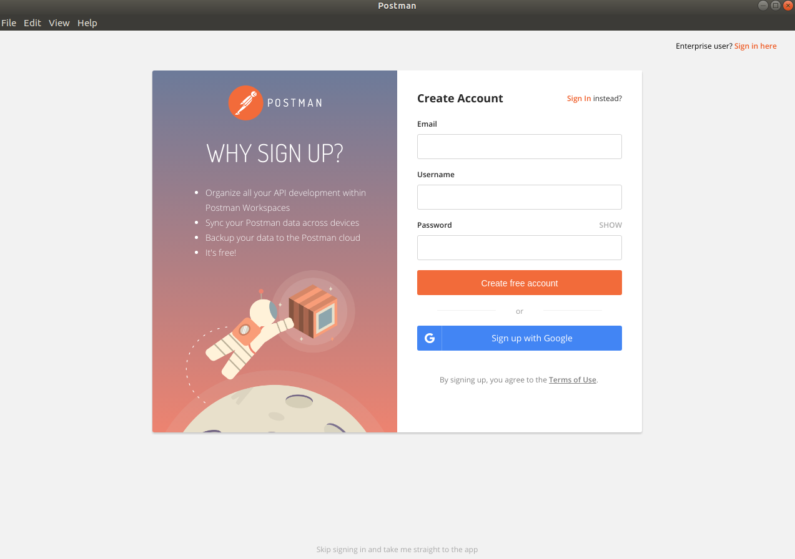
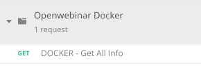

# Importación del proyecto Postman

La aplicacion **Postman** es una simple pero potente aplicación para poder consumir APIs o recursos a través de la red (para nuestro caso, consumiremos nuestro API REST).

Esta aplicación la podemos emplear como plugin de Google Chrome (actualmente deprecado) o como una aplicación nativa. Vamos a instalar la aplicación nativa, si ya la tuvieses instalada puedes saltar a la siguiente sección.

### Instalación de Postman

Accedemos al siguiente enlace

<https://www.getpostman.com/downloads/>

Y tras descargar y abrir la app nos pedirá una cuenta de usuario, podemos crear una nueva o emplear nuestro usuario de Google:

El login lo hacen especialmente para qeu puedas guardar tus proyectos y poder acceder a ellos desde cualquier sitio (*cuida con la seguridad...*). Tras registrarnos veremos una vista como la que sigue a continuación:

### Importar el proyecto de demo

En la nueva vista que se nos ha abierto deberemos hacer clic sobre el botón situado en la esquina superior izquierda *Import* y sobre la ventana emergente que aparece arrastrar y soltar (o ir al path determinado) el archivo `Openwebinar Docker.postman_collection`. Automáticamente quedará el proyecto importado y deberemos hacer clic sobre la opión de *Collections* para verlo:

Si hacemos clic sobre *Openwebinar Docker* se nos desplegarán las dos opciones que tenemos de demo para poder consumir la API:

### Lanzar la petición

A continuación deberemos hacer clic sobre *Get All info*, se nos abrira la petición que nos permite recuperar todos las entradas que hay en la BBDD, pulsemos sobre *Headers* es donde estarán las cabeceras necesarias para nuestra API:

Acto seguido pulsaremos el botón *Send* para ejecutar la petición y deberemos obtener:

### Resultado final

Si la petición ha ido correctamente la aplicación desplegada en el contenedor de WL que consume la BBDD del contenedor de Oracle DB habrá quedado correctamente configurada.
Sino, habrá que revisar como están desplegados los contenedores y como se ha desplegado la aplicación dentro de WL.

Habiendo finalizado esto ya tendríamos un entorno funcional Oracle basado en contenedores. En los siguientes temas vamos a empezar con las primeras prácticas.
