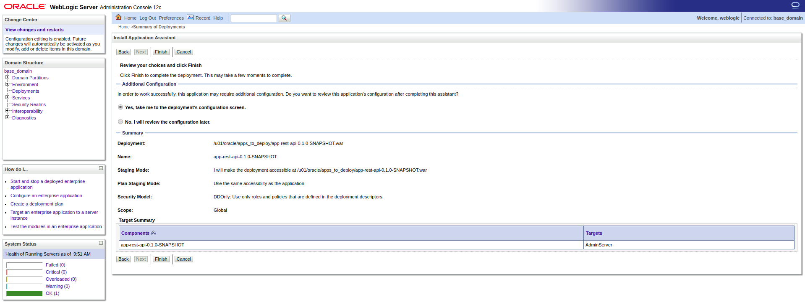
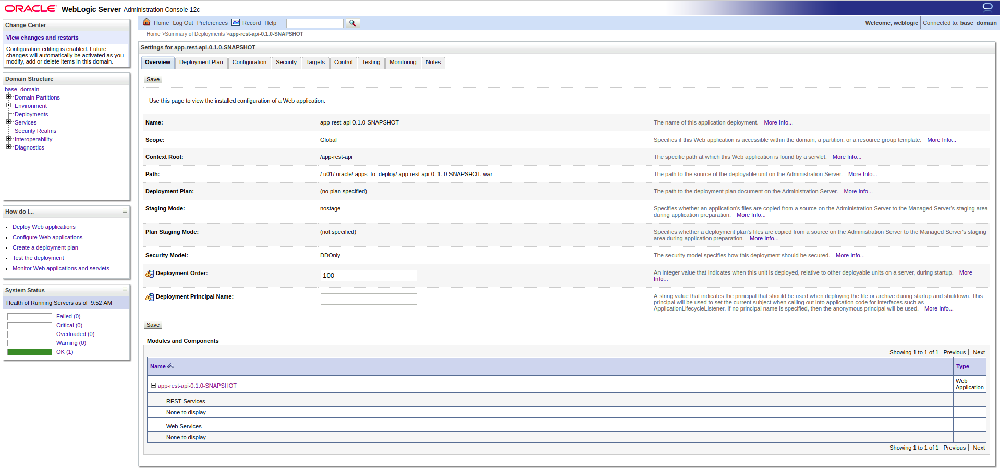
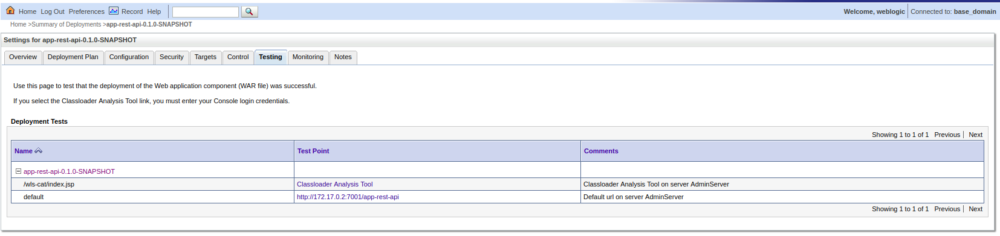

# Despliegue del API REST en Weblogic

En el clase anterior creamos una aplicación **REST** que nos consumía datos del contenedor con el Oracle DB. A continuación vamos a ver como desplegar esta aplicación en WL y en la siguiente sección de esta clase veremos como poder consumirlo [pulsa aquí para ir directamente](./Explicación Importación Del Proyecto Postman.md).

Tras tener el archivo *war* como vimos en la anterior clase y copiado al contenedor (a modo de recordatorio empleando el comando `docker cp ./OpenwebinarDockerAPI/openwebinar_mavel/app-rest-api/target/app-rest-api-0.1.0-SNAPSHOT.war oracle-wl:/u01/oracle/apps_to_deploy/` adaptado al path de la máquina de cada uno).

Deberemos ir a la consola de WL e ir a la sección de *Deployments*. Ahí se nos abrira una nueva vista y deberemos pulsar sobre el botón de **install**, nos aparecerá la siguiente vista y deberemos poner en el input lo que se muestra en la imagen:


&nbsp;&nbsp;&nbsp;- **Path**: /u01/oracle/apps_to_deploy/app-rest-api-0.1.0-SNAPSHOT.war

&nbsp;&nbsp;&nbsp;- **Current Location**: deberá estar seleccionado *app-rest-api-0.1.0-SNAPSHOT.war*.

Y a continuación pulsaremos sobre el botón *Next* para poder pasar a la siguiente vista que nos preguntará si nuestro **WAR** es una **aplicación** o una librería:


Seleccionaremos la opción `Install this deployment as an application` y pulsaremos sobre *Next*. En la siguiente vista sólo seleccionaremos la opción `I will make the deployment accessible from the following location`:


Pulsaremos sobre el botón de *Next* para terminar ya la configuración. En la vista siguiente generalmente se suele emplear la opción `No, I will review the configuration later.` para ir más rápido, pero en este caso para ver las distintas configuraciones seleccionaremos la opción `Yes, take me to the deployment's configuration screen`:



Tras pulsar a *Next* se nos pondrá una vista con la configuración general de WAR:



Y si vamos a la sección de **Testing** podremos ver la **dirección IP** que tiene el contenedor y el rescuso de nuestra aplicación que definimos en el archivo `app-rest-api/src/main/webapp/WEB-INF/weblogic.xml`:

```
    <wls:context-root>/app-rest-api</wls:context-root>
```



Salvo expresa necesidad, en nuestro caso podremos emplear localhost, ya que hemos redirigido el tráfico de nuestro localhost puerto 7001 al puerto del contenedor, como recordatorio:

```
docker run -d --name oracle-wl -p 7001:7001 -p 9002:9002 -v $PWD_WL:/u01/oracle/properties/domain.properties store/oracle/weblogic:12.2.1.3-dev
```

Con la opción `-p` creamos un tunel de nuestra máquina al contenedor, por ello y volviendo a nuestro caso, en vez de emplear `http://172.17.0.2:7001/app-rest-api` podremos emplear `http://localhosts:7001/app-rest-api` como podemos ver en el siguiente ejemplo:

<http://172.17.0.2:7001/app-rest-api/avengers/get/1> vs <http://localhost:7001/app-rest-api/avengers/get/1>

Finalmente para validar que esté todo bien desplegado iremos a la sección de "Deployments" y deberemos ver la aplicación como se muestra a continuación:


Deberá estar la sección de *State* a **Active** y la sección de *Health* a **OK**.
