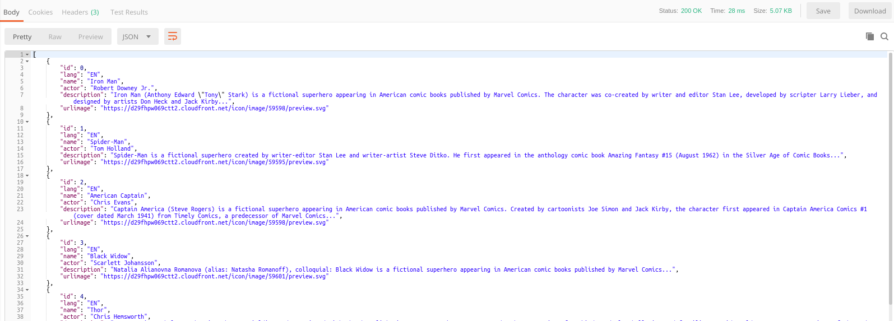

# Lanzar las dos peticiones

Para añadir una nueva petición deberemos pulsar sobre el **más** que está en la sección de las pestañas:

Posteriormente deberemos rellenar la información del endpoint:

&nbsp;&nbsp;&nbsp;- **Tipo de petición**: GET

&nbsp;&nbsp;&nbsp;- **URL**: http://localhost:7001/app-rest-api/avengers/getOne

&nbsp;&nbsp;&nbsp;- Headers:

&nbsp;&nbsp;&nbsp;&nbsp;&nbsp;&nbsp;- **Accept**: application/json, text/plain, */*

&nbsp;&nbsp;&nbsp;&nbsp;&nbsp;&nbsp;- **Accept-Encoding**: gzip, deflate, br

&nbsp;&nbsp;&nbsp;&nbsp;&nbsp;&nbsp;- **Accept-Language**: en-US,en;q=0.9,es-ES;q=0.8,es;q=0.7

&nbsp;&nbsp;&nbsp;&nbsp;&nbsp;&nbsp;- **X-Requested-With**: XMLHttpRequest

Finalmente guardaremos la petición pulsando `ctrl + s` y aparecera una ventana emergente, la rellenaremos como se muestra a continuación:

Es decir, en la *Request name* pondremos *DOCKER - Get One* y posteriormente seleccionaremos la carpeta *Openwebinar Docker*. Finalmente haremos clic sobre *Save to Openwebinar Docker*.

A continuación (para validar el funcionamiento de lo ya creado) deberemos hacer clic sobre *Get All info*, se nos abrira la petición que nos permite recuperar todos las entradas que hay en la BBDD, pulsemos sobre *Headers* es donde estarán las cabeceras necesarias para nuestra API:

Acto seguido pulsaremos el botón *Send* para ejecutar la petición y deberemos obtener:

Si hacemos lo mismo con la otra petición obtendremos:

### Resultado final

Si ambas peticiones han ido correctamente la aplicación desplegada en el contenedor de WL que consume la BBDD del contenedor de Oracle DB habrá quedado correctamente configurada.
Sino, habrá que revisar como están desplegados los contenedores y como se ha desplegado la aplicación dentro de WL.

Habiendo finalizado esto ya tendríamos un entorno funcional Oracle basado en contenedores. En los siguientes temas vamos a empezar con las primeras prácticas.
